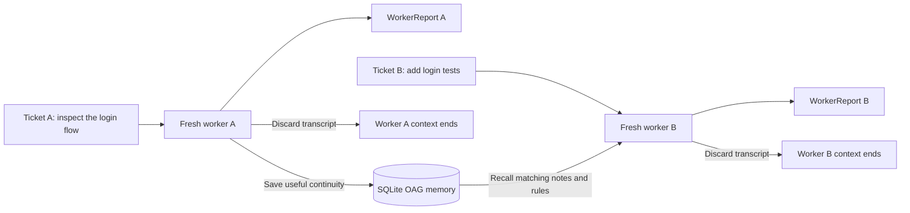
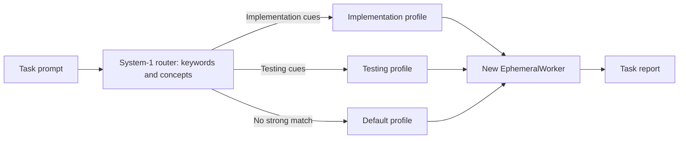
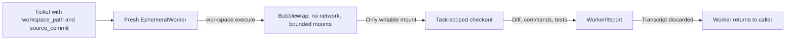

<div align="center">


# 👻 gh0st SDK

### One fresh worker per task. Memory that carries forward.

gh0st gives your app a local dispatcher and a clean, short-lived worker loop. Each task starts with only its prompt and relevant saved context; its transcript is discarded when the task finishes.

**Keep the useful memory. Drop the conversation baggage.**

[Why gh0st](#why-a-fresh-worker) · [How it works](#one-task-one-clean-worker) · [Quick start](#quick-start) · [OAG memory](#oag-explained) · [Boundaries](#what-the-sdk-owns)

<br />


</div>

---

## Why a fresh worker?

In a long-running agent conversation, yesterday’s tool output, old instructions, and the current task can all compete for space in the same model context. That makes each new turn carry history it may not need. Routing work to a specialist can also mean adding another model call just to ask, “Who should handle this?”

gh0st separates **task context** from **lasting memory**:

| A long-running agent thread | A gh0st worker loop |
| --- | --- |
| Conversation history keeps growing | A new worker context is created for each ticket |
| Old turns travel with new requests | The worker receives the new task and selected memory only |
| A model may be asked to choose the next specialist | Local System-1 rules route the task before a model call |
| Continuity is tied to keeping the thread alive | Useful facts can be saved in SQLite OAG memory |

The result is a clean start for every task without throwing away information that is worth keeping. Smaller, relevant context can improve token efficiency; actual savings depend on your prompts, memory selection, and provider.

## One task, one clean worker

`Gh0stSDK.run(ticket)` selects a worker profile, prepares a prompt with relevant OAG context, and creates an `EphemeralWorker`. The worker can make several model/tool calls while completing that one task. When it returns a `WorkerReport`, its conversation transcript is gone. Only the report and selected continuity records remain.



There is no shared, ever-growing chat transcript between Ticket A and Ticket B. Worker B sees Ticket B plus whatever scoped records OAG recalls. This is the core loop whether gh0st is called directly, from a script, or from a larger agent framework.

## System-1: choose the worker before calling a model

System-1 is gh0st’s small, local routing step. You define worker profiles with cues such as keywords and ontology concepts. For each ticket, the router checks those cues, scores the matches, and chooses a profile. If nothing matches, it selects the configured default. This decision uses local rules; it does not spend a model call on worker assignment.



A profile holds the worker’s intent, model ID, instructions, and registered tools. The ticket’s capability grants filter which of those tools are exposed for that run. The model completes the work; System-1 handles the local “which worker?” decision.

This is useful when an application has repeatable task types—implementation, tests, review, documentation—and wants predictable dispatch without starting every task with another model-based planner. Routing is intentionally transparent: define cues and a default, then inspect the resulting `worker_name` in the report.

## OAG explained

**OAG means Ontology-Augmented Generation.** In gh0st, it is a built-in SQLite memory store with records that have a scope, type, source, and optional concepts. An ontology is the vocabulary you provide for related ideas—for example, the concept `authentication` could include aliases such as `login`, `JWT`, and `token validation`.

When a task arrives, OAG uses matching words and concepts to find relevant records in that task’s scope. gh0st adds the selected records to the worker prompt with their source and trust label. It is a small, inspectable continuity store—not a vector database, a hidden agent transcript, or a source of authority by itself.

| OAG record | How the worker receives it |
| --- | --- |
| Human-approved `RULE` | `System Instructions / Constraints` |
| Prior task `CONTINUITY` | `Retrieved Reference Context` |
| `REFERENCE` or unapproved rule | `Retrieved Reference Context`, labeled unverified |
| External memory hit | `Retrieved Reference Context` with its provider name, labeled unverified |

Rules start untrusted. An application must explicitly approve a rule with `SQLiteOAG.approve_rule(...)` before it is injected as a system constraint. Ordinary notes and external retrievals stay reference data; they are not silently promoted into instructions.

The SDK keeps its own OAG store even when you add a secondary memory source. Without the separate gh0st Gateway, you choose which secondary providers to configure; their results are supplemental and do not replace OAG.

## Quick start

The project is in early development and is not yet published on PyPI. The current implementation is on the [`feat/public-sdk-core` branch](https://github.com/Judge-M/gh0st-SDK/tree/feat/public-sdk-core). Clone it and install from the checkout:

```bash
git clone -b feat/public-sdk-core https://github.com/Judge-M/gh0st-SDK.git
cd gh0st-SDK
python -m pip install .
```

Then connect a direct OpenAI-compatible provider and define the worker profiles your app needs:

```python
import os

from gh0st import (
    Concept,
    Gh0stSDK,
    Ontology,
    OpenAICompatibleProvider,
    SQLiteOAG,
    SQLiteStateLedger,
    System1WorkerRouter,
    Ticket,
    WorkerProfile,
)

sdk = Gh0stSDK(
    provider=OpenAICompatibleProvider(
        api_key=os.environ["MODEL_API_KEY"],
        base_url=os.getenv("MODEL_BASE_URL", "https://api.openai.com/v1"),
    ),
    workers=(
        WorkerProfile(
            name="implementer",
            intent="code implementation",
            model="provider:code-model",
            instructions="Implement the requested change and report what you did.",
            keywords=("implement", "fix", "refactor"),
            is_default=True,
        ),
        WorkerProfile(
            name="tester",
            intent="test writing",
            model="provider:test-model",
            concepts=("authentication",),
        ),
    ),
    router=System1WorkerRouter(Ontology([
        Concept("authentication", ("login", "JWT", "token validation")),
    ])),
    memory=SQLiteOAG(".gh0st/oag.sqlite3"),
    ledger=SQLiteStateLedger(".gh0st/state.sqlite3"),
)

report = sdk.run(Ticket(
    prompt="Add regression tests for the JWT authentication parser.",
    scope="repo:my-service",
))

print(report.worker_name, report.status)
print(report.output)
```

For trusted application functions, register Python callbacks on a `WorkerProfile` and grant their capability names on the ticket. These callbacks execute with the embedding process's permissions. Use the bounded workspace capability below for model-directed repository work.

## Bounded workspace execution

For code tasks, give a ticket a task-scoped checkout and the `workspace.execute` capability. On Linux, gh0st exposes one `workspace_command` tool that can inspect, edit, test, lint, and make local Git changes inside that directory. Bubblewrap mounts the checkout as the only writable host directory, runs with no network namespace access, and fails closed if bubblewrap is missing. The model provider call happens outside the sandbox; the worker command cannot use the provider credentials.



```python
report = sdk.run(Ticket(
    prompt="Refactor the parser, run its tests, and report any failures.",
    scope="repo:my-service",
    workspace_path="/var/tmp/gh0st/tasks/task-123",
    source_commit="<full commit hash copied into the task checkout>",
    permitted_local_capabilities=("workspace.execute",),
    max_tokens_allocated=12_000,
))

print(report.status, report.diff)
print(report.commands_executed)
print(report.test_results, report.unresolved_failures)
```

The caller owns workspace creation and supplies an already bounded directory. The SDK checks the checkout's `HEAD` against `source_commit`, records commands and test/lint results, and returns a diff in `WorkerReport`. The built-in shell tool cannot push, write to production systems, or access the network. Configure the read-only test runtime with `GH0ST_SANDBOX_RUNTIME` when commands need packages from a virtual environment.

The SDK can also run without a gateway: pass a direct compatible provider as above. In a gateway integration, Core supplies the selected model, one tool schema, trusted rules, and selected reference context; the SDK selects the worker profile, executes the bounded local turn, and returns evidence. Core remains responsible for task quotas, provider spend accounting, external grants, and secondary memory-provider routing. These packages communicate through Python contracts, not a server protocol.

## What the SDK owns

| In the public SDK | In the separate gh0st Gateway or embedding app |
| --- | --- |
| System-1 routing to a configured worker profile | Dynamic selection among providers, models, tools, and secondary memory services |
| Fresh per-ticket worker context and bounded Linux workspace tool | Provider policy and account-level financial ceilings |
| Built-in SQLite OAG and local ticket/report ledger | Task-level cost accounting and admission policy |
| Per-ticket capability filtering and turn/tool/output-token limits | Hosting, remote relay, and gateway operations |

The SDK can call a configured OpenAI-compatible endpoint directly; no Gateway is required for local use. Ticket fields such as `max_cost_usd` and `gateway_allowance` are passed through as metadata. The SDK clamps output-token requests using `max_tokens_allocated`, but it does not account for provider spend.

Registered Python callbacks are trusted extensions and run with the host process’s permissions. Capability filtering controls which callbacks a worker may call; it does not sandbox their code. Model-directed shell commands should use `workspace.execute`, which runs through the Linux isolation boundary described above.

## Use gh0st inside your existing stack

gh0st is a specialist execution layer, not a replacement for your outer workflow:

- **LangGraph:** call `sdk.run(ticket)` from a graph node when a task needs its own worker context.
- **CrewAI:** wrap `sdk.run(ticket)` as a custom tool for a developer agent.
- **OpenAI Agents SDK:** expose it as a function tool or bounded specialist.

The existing framework keeps its workflow and decides when to delegate. gh0st selects its worker, runs the task, and returns a structured report. Framework-specific adapters are not bundled yet.

## CLI and REPL

Set `GH0ST_MODEL` and `GH0ST_API_KEY` (or `OPENAI_API_KEY`), then run:

```bash
gh0st
gh0st run "Summarize this project"
gh0st run --model vendor:model "Review the API design"
```

`GH0ST_BASE_URL` selects a direct OpenAI-compatible endpoint. OAG and ticket state default to `~/.gh0st/`; override them with `GH0ST_OAG_DB` and `GH0ST_STATE_DB`.

## License

Apache-2.0. See [LICENSE](LICENSE).
